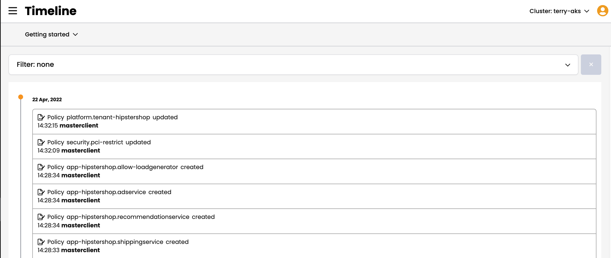

## Audit

With Access, Security Policy and Encryption in place, the next step is to be able to audit the environment for changes and unwanted activity.

The following types of data are logged by Calico Cloud:

* Audit Logs
* DNS Logs
* Flow Logs

This data is stored in the Elasticsearch database for retention, review and export.

## Policy Audit Timeline

Policy Audit logs are also accessible through the Calico Cloud UI directly through the Timeline feature.  To view these logs:

1. Open the Timeline page from the left navigation menu.


2. Either browse through the list of Audit Events or search using the filter at the top of the page.
  * Policy Audit Timeline

    

  * Policy Audit Filter

    

3. Policy Audit Events contain the policy effected, the user to make the change and the manifest of the updated policy.


## Policy Audit Inside of Policy

Within each Policy, there is a Change Log that allows you to see the audit entries for the specific policy you are currently viewing.

To access this information, 

1. Open a Policy from from the Policies page and scroll down to the Change Log section.


2. Click on the diff button on an Audit Event to expand the details of that event.


3. To view the change in detail, click the 'Diff' button in the top right to bring up a side by side comparison of the two versions.


### Kubernetes Host logs

To enable the collection of Kubernetes audit logs, an audit policy must be enabled on the cluster. To enable on a local cluster apply the following manifest:

```yaml
kubectl apply -f -<<EOF
apiVersion: audit.k8s.io/v1beta1
kind: Policy
omitStages:
  - RequestReceived
rules:
  - level: RequestResponse
    verbs:
      - create
      - patch
      - update
      - delete
    resources:
      - group: networking.k8s.io
        resources: ["networkpolicies"]
      - group: extensions
        resources: ["networkpolicies"]
      - group: ""
        resources: ["pods", "namespaces", "serviceaccounts", "endpoints"]
EOF
```
> Manifest File: [5.1-kubernetes-audit-logs.yaml](manifests/5.1-kubernetes-audit-logs.yaml)


See more details in the [Calico Enterprise Documentation](https://docs.tigera.io/visibility/elastic/kube-audit#about-kubernetes-audit-logs)


### Log Export

Logs can be exported to an external SIEM such as Splunk, syslog, or Amazon S3. To setup log export please open a [Support Ticket](https://support.tigera.io/).


### Audit Requirements

- Stop using calicoctl
  - Because calicoctl cannot provide audit log data, you can no longer use calicoctl to manage resources (Calico Enterprise and Kubernetes) for compliance reporting. Instead, use kubectl, Manager UI, or the Kubernetes API, to manage policy, tiers, and host endpoints.

- Ensure that all nodes in your Kubernetes clusters must be time-synchronized using NTP or similar (for accurate audit log timestamps)

### Calico Cloud Limitations
>**Make notes about exceptions in audit log collection/retention such as Azure**

When using a hosted kuberenetes service such as AKS, you will not have access to the kubernetes cluster audit logs.


### Reference Documentation


